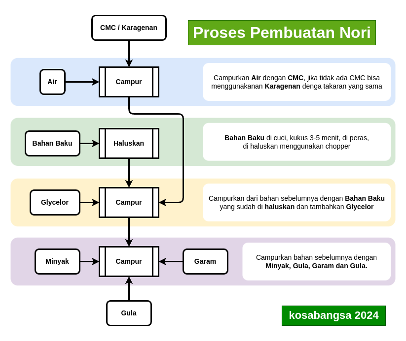

# Takaran Standar

| Bahan            | jumlah |
| ---------------- | ------ |
| Bahan Baku       | 65%    |
| Air              | 22%    |
| CMC / karagenan | 4%     |
| Glycerol         | 5%     |
| Gula Pasir       | 1%     |
| Garam            | 1%     |
| Minyak Goreng    | 2%     |

# Kalkulator

# Proses Pembuatan

